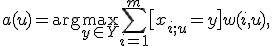
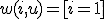
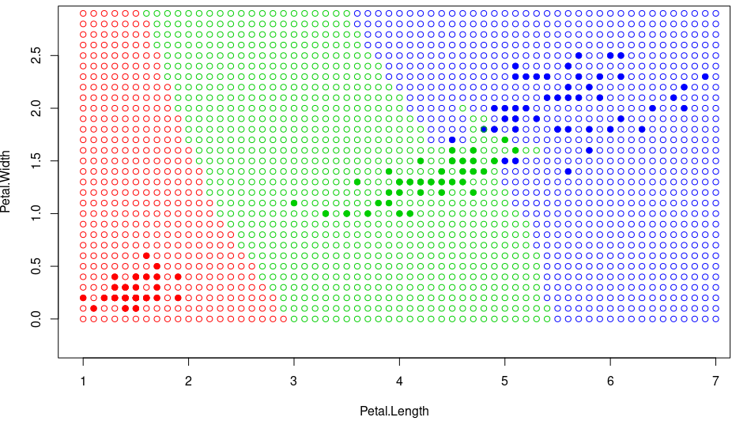
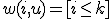
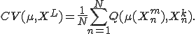
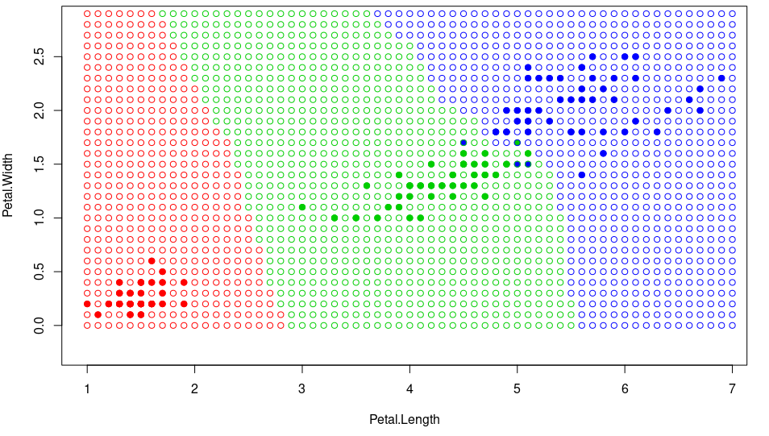
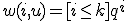

**Метод ближайших соседей** — простейший метрический классификатор, основанный на оценивании сходства объектов. Классифицируемый объект относится к тому классу, которому принадлежат ближайшие к нему объекты обучающей выборки.



**Метод ближайшего соседа**



1NN:



**Алгорим k ближайших соседей**



kNN относит объект u к тому классу, элементов которого больше среди k ближайших соседей:

Код kNN:
```R
kNN <- function(xl, z, k) {
  orderedXl <- sortObjectsByDist(xl, z)
  n <- dim(orderedXl)[2] - 1
  classes <- orderedXl[1:k, n + 1]
  counts <- table(classes)
  class <- names(which.max(counts))
  return (class)
}
```

При неоптимальных k получим неустройсчивость к шуму, при k = l, наоброт, алгорим чрезмерно устойчив к и вырождается в константу. На практике отимальное k будем подбирать по критерию скользящего контроля LOO.

**Скользящий контроль или кросс-проверка или кросс-валидация (cross-validation, CV)** — процедура эмпирического оценивания обобщающей способности алгоритмов, обучаемых по прецедентам.

Фиксируется некоторое множество разбиений исходной выборки на две подвыборки: обучающую и контрольную. Для каждого разбиения выполняется настройка алгоритма по обучающей подвыборке, затем оценивается его средняя ошибка на объектах контрольной подвыборки. Оценкой скользящего контроля называется средняя по всем разбиениям величина ошибки на контрольных подвыборках.

Если выборка независима, то средняя ошибка скользящего контроля даёт несмещённую оценку вероятности ошибки. Это выгодно отличает её от средней ошибки на обучающей выборке, которая может оказаться смещённой (оптимистически заниженной) оценкой вероятности ошибки, что связано с явлением переобучения.

Скользящий контроль является стандартной методикой тестирования и сравнения алгоритмов классификации, регрессии и прогнозирования.



После завершения алгоритма LOO, получаем оптимальное k = 6.

6NN:



**Метод взвешенных ближайших соседей.**



В задачах с числом классов 3 и более нечётность уже не помогает, и ситуации неоднозначности всё равно могут возникать. Тогда i-му соседу приписывается вес wi, как правило, убывающий с ростом ранга соседа i. Объект относится к тому классу, который набирает больший суммарный вес среди k ближайших соседей.

Код kWNN:
```R
weight <- function(i, k) {
  return((k + 1 - i) / k)
}

kWNN <- function(xl, z, k) {
  orderedXl <- sortObjectsByDist(xl, z)
  n <- dim(orderedXl)[2] - 1
  weights <- rep(0,3)
  names(weights) <- c("setosa", "versicolor", "virginica")
  classes <- orderedXl[1:k, n + 1]
  for(i in 1:k) {
    weights[classes[i]] <- weight(i,k) + weights[classes[i]];
  }
  class <- names(which.max(weights))
  return(class)
}
```


