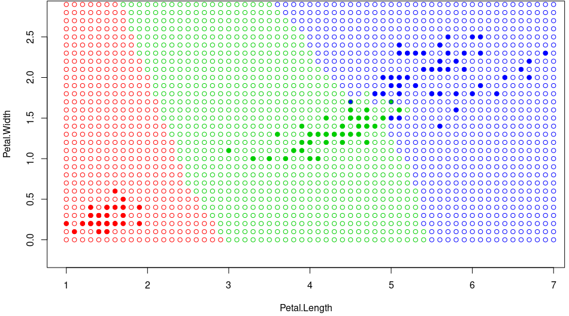
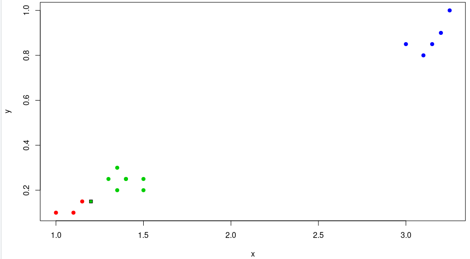
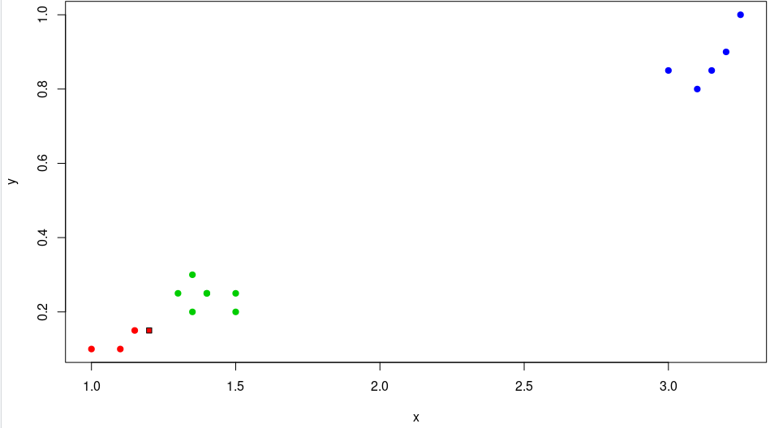
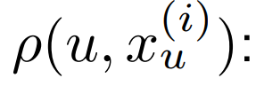
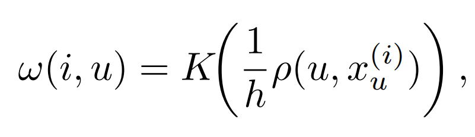
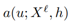
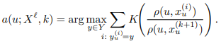
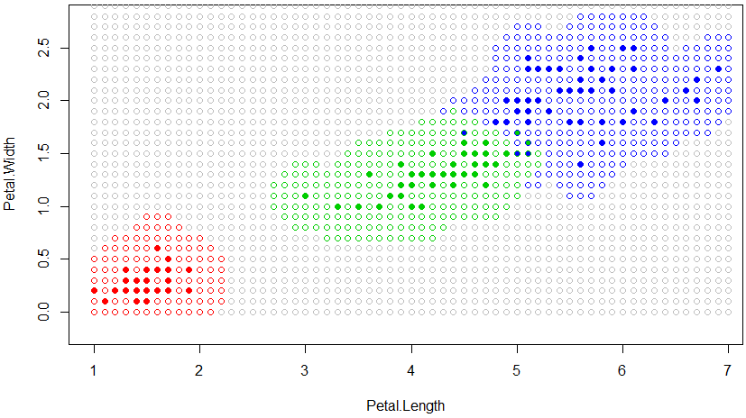
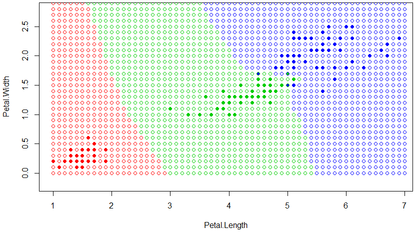

**Метод ближайших соседей** — простейший метрический классификатор, основанный на оценивании сходства объектов. Классифицируемый объект относится к тому классу, которому принадлежат ближайшие к нему объекты обучающей выборки.


**Метод ближайшего соседа**


Карта классификации для 1NN:


**Алгорим k ближайших соседей**


kNN относит объект u к тому классу, элементов которого больше среди k ближайших соседей:

Код kNN:
```R
kNN <- function(xl, z, k) {
  orderedXl <- sortObjectsByDist(xl, z)
  n <- dim(orderedXl)[2] - 1
  classes <- orderedXl[1:k, n + 1]
  counts <- table(classes)
  class <- names(which.max(counts))
  return (class)
}
```

При неоптимальных k получим неустройсчивость к шуму, при k = l, наоброт, алгорим чрезмерно устойчив к и вырождается в константу. На практике отимальное k будем подбирать по критерию скользящего контроля LOO.

**Скользящий контроль или кросс-проверка или кросс-валидация (cross-validation, CV)** — процедура эмпирического оценивания обобщающей способности алгоритмов, обучаемых по прецедентам.

Фиксируется некоторое множество разбиений исходной выборки на две подвыборки: обучающую и контрольную. Для каждого разбиения выполняется настройка алгоритма по обучающей подвыборке, затем оценивается его средняя ошибка на объектах контрольной подвыборки. Оценкой скользящего контроля называется средняя по всем разбиениям величина ошибки на контрольных подвыборках.

Если выборка независима, то средняя ошибка скользящего контроля даёт несмещённую оценку вероятности ошибки. Это выгодно отличает её от средней ошибки на обучающей выборке, которая может оказаться смещённой (оптимистически заниженной) оценкой вероятности ошибки, что связано с явлением переобучения.

Скользящий контроль является стандартной методикой тестирования и сравнения алгоритмов классификации, регрессии и прогнозирования.


После завершения алгоритма LOO, получаем оптимальное k = 6.

Карта классификации для 6NN:


**Метод взвешенных ближайших соседей.**


В задачах с числом классов 3 и более нечётность уже не помогает, и ситуации неоднозначности всё равно могут возникать. Тогда i-му соседу приписывается вес wi, как правило, убывающий с ростом ранга соседа i. Объект относится к тому классу, который набирает больший суммарный вес среди k ближайших соседей.

Код kWNN:
```R
weight <- function(i, k, q) {
  return (q ^ i)
}

kWNN <- function(xl, z, k, q) {
  orderedXl <- sortObjectsByDist(xl, z)
  n <- dim(orderedXl)[2] - 1
  weights <- rep(0,3)
  names(weights) <- c("setosa", "versicolor", "virginica")
  classes <- orderedXl[1:k, n + 1]
  for(i in 1:k) {
    weights[classes[i]] <- weight(i,k,q) + weights[classes[i]];
  }
  class <- names(which.max(weights))
  return(class)
}
```

После завершения алгоритма LOO, получаем оптимальное k = 6, q = 0.56.

Карта классификации для 6WNN:



**Преимущества kWNN над KNN:**

Рассмотрим следующую выборку:

Код kWNN:
```R
colors <- c("class-1" = "red", "class-2" = "green3", "class-3" = "blue")

df = data.frame(x = double(), y = double(), class = character())

df <- rbind(df, data.frame(x = 1, y = 0.1, class = "class-1"))
df <- rbind(df, data.frame(x = 1.15, y = 0.15, class = "class-1"))
df <- rbind(df, data.frame(x = 1.1, y = 0.1, class = "class-1"))
df <- rbind(df, data.frame(x = 1.5, y = 0.2, class = "class-2"))
df <- rbind(df, data.frame(x = 1.35, y = 0.2, class = "class-2"))
df <- rbind(df, data.frame(x = 1.3, y = 0.25, class = "class-2"))
df <- rbind(df, data.frame(x = 1.5, y = 0.25, class = "class-2"))
df <- rbind(df, data.frame(x = 1.35, y = 0.3, class = "class-2"))
df <- rbind(df, data.frame(x = 1.4, y = 0.25, class = "class-2"))
df <- rbind(df, data.frame(x = 1.4, y = 0.25, class = "class-2"))
df <- rbind(df, data.frame(x = 3, y = 0.85, class = "class-3"))
df <- rbind(df, data.frame(x = 3.2, y = 0.9, class = "class-3"))
df <- rbind(df, data.frame(x = 3.25, y = 1, class = "class-3"))
df <- rbind(df, data.frame(x = 3.1, y = 0.8, class = "class-3"))
df <- rbind(df, data.frame(x = 3.15, y = 0.85, class = "class-3"))
plot(df[c("x", "y")], pch = 19, col = colors[df$class])

z <- c(1.2, 0.15)
#class <- kNN(df, z, k=7)
class <- kWNN(df, z, k=7, q=0.56)
print(class)
points(z[1], z[2], pch = 22, bg = colors[class], asp = 1)

```
Результат работы KNN:



Результат работы KWNN:



**Метод парзеновского	окна**

Рассмотрим весовую функцию ω(i, u) как функцию не от ранга соседа, а как функцию от расстояния :



где K(z) — невозрастающая на [0,∞) (гипотеза компактности) функция ядра. В этом случае метрический классификатор примет следующий вид:


Алгоритм  называется алгоритмом парзеновского окна.

Параметр h называется шириной окна и играет примерно ту же роль, что и число соседей k. “Окно” — это сферическая окрестность объекта u радиуса h, при попадании в которую обучающий объект xi “голосует” заотнесение объекта u к классу yi.

Параметр h можно задавать априори или определять по скользящему контролю. Зависимость LOO(h), как правило, имеет характерный минимум, поскольку слишком узкие окна приводят к неустойчивой классификации; а слишком широкие — к вырождению алгоритма в константу.

Если объекты существенно неравномерно распределены по пространству X, то необходимо использовать метод парзеновского окна с переменной шириной окна:



**Рассмотрим часто используемые ядра:**

**Прямоугольное:**



**Треугольное:**


**Епанечникова:**


**Квартическое:**


**Гауссовское:**




