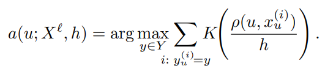
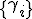
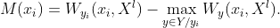

**Метод ближайших соседей** — простейший метрический классификатор, основанный на оценивании сходства объектов. Классифицируемый объект относится к тому классу, которому принадлежат ближайшие к нему объекты обучающей выборки.


**Метод ближайшего соседа**


Карта классификации для 1NN:


**Алгорим k ближайших соседей**


kNN относит объект u к тому классу, элементов которого больше среди k ближайших соседей:

Код kNN:
```R
kNN <- function(xl, z, k) {
  orderedXl <- sortObjectsByDist(xl, z)
  n <- dim(orderedXl)[2] - 1
  classes <- orderedXl[1:k, n + 1]
  counts <- table(classes)
  class <- names(which.max(counts))
  return (class)
}
```

При неоптимальных k получим неустройсчивость к шуму, при k = l, наоброт, алгорим чрезмерно устойчив к и вырождается в константу. На практике отимальное k будем подбирать по критерию скользящего контроля LOO.

**Скользящий контроль или кросс-проверка или кросс-валидация (cross-validation, CV)** — процедура эмпирического оценивания обобщающей способности алгоритмов, обучаемых по прецедентам.

Фиксируется некоторое множество разбиений исходной выборки на две подвыборки: обучающую и контрольную. Для каждого разбиения выполняется настройка алгоритма по обучающей подвыборке, затем оценивается его средняя ошибка на объектах контрольной подвыборки. Оценкой скользящего контроля называется средняя по всем разбиениям величина ошибки на контрольных подвыборках.

Если выборка независима, то средняя ошибка скользящего контроля даёт несмещённую оценку вероятности ошибки. Это выгодно отличает её от средней ошибки на обучающей выборке, которая может оказаться смещённой (оптимистически заниженной) оценкой вероятности ошибки, что связано с явлением переобучения.

Скользящий контроль является стандартной методикой тестирования и сравнения алгоритмов классификации, регрессии и прогнозирования.


После завершения алгоритма LOO, получаем оптимальное k = 6.

Карта классификации для 6NN:


**Метод взвешенных ближайших соседей.**


В задачах с числом классов 3 и более нечётность уже не помогает, и ситуации неоднозначности всё равно могут возникать. Тогда i-му соседу приписывается вес wi, как правило, убывающий с ростом ранга соседа i. Объект относится к тому классу, который набирает больший суммарный вес среди k ближайших соседей.

Код kWNN:
```R
weight <- function(i, k, q) {
  return (q ^ i)
}

kWNN <- function(xl, z, k, q) {
  orderedXl <- sortObjectsByDist(xl, z)
  n <- dim(orderedXl)[2] - 1
  weights <- rep(0,3)
  names(weights) <- c("setosa", "versicolor", "virginica")
  classes <- orderedXl[1:k, n + 1]
  for(i in 1:k) {
    weights[classes[i]] <- weight(i,k,q) + weights[classes[i]];
  }
  class <- names(which.max(weights))
  return(class)
}
```

После завершения алгоритма LOO, получаем оптимальное k = 6, q = 0.56.

Карта классификации для 6WNN:


**Преимущества kWNN над KNN:**

Рассмотрим следующую выборку:

Код kWNN:
```R
colors <- c("class-1" = "red", "class-2" = "green3", "class-3" = "blue")

df = data.frame(x = double(), y = double(), class = character())

df <- rbind(df, data.frame(x = 1, y = 0.1, class = "class-1"))
df <- rbind(df, data.frame(x = 1.15, y = 0.15, class = "class-1"))
df <- rbind(df, data.frame(x = 1.1, y = 0.1, class = "class-1"))
df <- rbind(df, data.frame(x = 1.5, y = 0.2, class = "class-2"))
df <- rbind(df, data.frame(x = 1.35, y = 0.2, class = "class-2"))
df <- rbind(df, data.frame(x = 1.3, y = 0.25, class = "class-2"))
df <- rbind(df, data.frame(x = 1.5, y = 0.25, class = "class-2"))
df <- rbind(df, data.frame(x = 1.35, y = 0.3, class = "class-2"))
df <- rbind(df, data.frame(x = 1.4, y = 0.25, class = "class-2"))
df <- rbind(df, data.frame(x = 1.4, y = 0.25, class = "class-2"))
df <- rbind(df, data.frame(x = 3, y = 0.85, class = "class-3"))
df <- rbind(df, data.frame(x = 3.2, y = 0.9, class = "class-3"))
df <- rbind(df, data.frame(x = 3.25, y = 1, class = "class-3"))
df <- rbind(df, data.frame(x = 3.1, y = 0.8, class = "class-3"))
df <- rbind(df, data.frame(x = 3.15, y = 0.85, class = "class-3"))
plot(df[c("x", "y")], pch = 19, col = colors[df$class])

z <- c(1.2, 0.15)
#class <- kNN(df, z, k=7)
class <- kWNN(df, z, k=7, q=0.56)
print(class)
points(z[1], z[2], pch = 22, bg = colors[class], asp = 1)

```
Результат работы KNN:


Результат работы KWNN:


**Метод парзеновского	окна**

Рассмотрим весовую функцию ω(i, u) как функцию не от ранга соседа, а как функцию от расстояния :


где K(z) — невозрастающая на [0,∞) (гипотеза компактности) функция ядра. В этом случае метрический классификатор примет следующий вид:



Алгоритм  называется алгоритмом парзеновского окна.

Параметр h называется шириной окна и играет примерно ту же роль, что и число соседей k. “Окно” — это сферическая окрестность объекта u радиуса h, при попадании в которую обучающий объект xi “голосует” заотнесение объекта u к классу yi.

Параметр h можно задавать априори или определять по скользящему контролю. Зависимость LOO(h), как правило, имеет характерный минимум, поскольку слишком узкие окна приводят к неустойчивой классификации; а слишком широкие — к вырождению алгоритма в константу.

Если объекты существенно неравномерно распределены по пространству X, то необходимо использовать метод парзеновского окна с переменной шириной окна:


Код:
```R
euclideanDistance <- function(u,v) {
  sqrt(sum((u - v)^2))
}

Rect <- function(r) {
  (abs(r) <= 1) * 0.5
}

Tria <- function(r) {
  (abs(r) <= 1) * (1 - abs(r))
}

Epan <- function(r) {
  (abs(r) <= 1) * (1 - r^2)
}

Quar <- function(r) {
  (abs(r) <= 1) * (1 - r^2)^2
}

Gaus <- function(r) {
  dnorm(r)
}

parsen <- function(x, z, h, F) {
  m <- dim(x)[1]
  n <- dim(x)[2]-1
  classes <- rep(0, length(names(table(x[,n+1]))))
  names(classes) <- names(table(x[,n+1]))
  for(i in 1:m){
    y <- x[i, n+1]
    dist <- euclideanDistance(x[i,1:n],z)
    w <- F(dist/h)
    classes[y] <- classes[y] + w
  }
  if(sum(classes) > 0) {
    class <- names(which.max(classes))
  } else {
    class <- "unknown"
  }
  return(class)
}
```

**Рассмотрим часто используемые ядра:**

**Прямоугольное:**

Оптимальная ширина окна h = 0.35, оценка LOO = 0.04


**Треугольное:**

Оптимальная ширина окна h = 0.35, оценка LOO = 0.04


**Епанечникова:**

Оптимальная ширина окна h = 0.35, оценка LOO = 0.04


**Квартическое:**

Оптимальная ширина окна h = 0.35, оценка LOO = 0.04


Хочется выделить хорошее качество классификации при правильно выбранном h и не гибкость алгоритма, т.к. параметры ширины требуется подбирать под конкретную обучающую выборку и хранить эту выборку целиком. 

**Метод потенциальных функций**

Общая идея метода иллюстрируется на примере электростатического взаимодействия элементарных частиц. Известно, что потенциал («мера воздействия») электрического поля элементарной заряженной частицы в некоторой точке пространства пропорционален отношению заряда частицы (Q) к расстоянию до частицы (r): 

Метод потенциальных функций реализует полную аналогию указанного выше примера. При классификации объект проверяется на близость к объектам из обучающей выборки. Считается, что объекты из обучающей выборки «заряжены» своим классом, а мера «важности» каждого из них при классификации зависит от его «заряда» и расстояния до классифицируемого объекта.

Метод потенциальных функций заключается в выборе в качестве w(i,u) весовой функции следующего вида: 

**Описание алгоритма:**

1. Инициализация: 

2. Повторять пункты 3-4, пока 

3.  Выбрать очередной объект xi из выборки Xl;

4.  Если , то 

5. Вернуть значения 

Код:
```R
potentialF <- function(x, z, g, F, h=c()) {
    m <- dim(x)[1]
    n <- dim(x)[2]-1
    if(sum(h) == 0) h <- c(rep(1, m/3), rep(0.25,(m - m / 3)))
    classes <- rep(0, length(names(table(x[,n+1]))))
    names(classes) <- names(table(x[,n+1]))
    for(i in 1:m) {
        y <- x[i, n+1]
        dist <- Distanse(x[i,1:n],z)
        w <- F(dist/h[i]) * g[i]
        classes[y] <- classes[y] + w
    }
    if(sum(classes) > 0) {
        class <- names(which.max(classes))
    } else {
        class <- "unknown"
    }
    return(class)
}
```

**Прямоугольное:**


**Треугольное:**


**Епанечникова:**


**Квартическое:**


Преимущества метода потенциальных функций:

1) Метод прост для понимания и алгоритмической реализации;

2) Порождает потоковый алгоритм;

3) Хранит лишь часть выборки, следовательно, экономит память.

Недостатки метода:

1) Порождаемый алгоритм медленно сходится;

2) Параметры  и  настраиваются слишком грубо;

3) Значения параметров  зависят от порядка выбора объектов из выборки .

**Алгоритм STOLP**

С помощью алгоритма STOLP классифицируем объекты на эталонные, неинформативные, шумовые. Классификация объектов на данные типы выполняется благодаря отступам. Отступ показывает степень типичности объекта. Формула вычисления отступа: 



**Алгоритм:**

Вход:
1) Выборка 
2) Допустимая доля ошибок 
3) Порог отсечения выбросов δ
4) Алгоритм классификации
5) Формула для вычисления величины риска W.

Описание:
1) Отбросить выбросы (объекты  с W>δ)
2) Сформировать начальное приближение   из объектов выборки  выбрать по одному объекту каждого класса, обладающему среди объектов данного класса максимальной величиной риска, либо минимальной величиной риска
3) Наращивание множества эталонов (пока число объектов выборки  распознаваемых неправильно, не станет меньше ):

3.1) Классифицировать объекты , используя в качестве обучающей выборки 

3.2) Пересчитать величины риска для всех объектов  с учетом изменения обучающей выборки

3.3) Среди объектов каждого класса, распознанных неправильно, выбрать объекты с максимальной величиной риска и добавить их к  


Результат:
Множество эталонов  для каждого класса представляет собой некоторый набор объектов, находящихся на границе класса, и, если в качестве начального приближения выбирались объекты с минимальной величиной риска, один объект, находящийся в центре класса.

**Байесовские методы классификации**

**Линии уровня нормального распределения**

Рассмотрим многомерное нормальное распределение. Пусть .

Определение

Вероятностное распределение с плотностью

.

называется n-мерным многомерным нормальным (гауссовским) распределением с математическим ожиданием (центром)  и ковариационной матрицей . Предполагается, что матрица  симметричная, невырожденная, положительно определенная.

Геометрия нормальной плотности.

1) Если признаки некоррелированы,  то линии уровня плотности распределения имеют форму эллипсоидов с центром  и осями, параллельными осям координат.


2) Если признаки имеют одинаковые дисперсии , то эллипсоиды являются сферами.


3) Если признаки коррелированы, то матрица Σ не диагональна и линии уровня имеют форму эллипсоидов, оси которых повернуты (направлены вдоль собственных векторов матрицы Σ) относительно исходной системы координат.

С помощью ортогонального преобразования  — ортогональные собственные векторы матрицы Σ, можно перейти к первому случаю.


**Наивный байесовский классификатор**

Наивный байесовский классификатор (naїve Bayes) — специальный частный случай байесовского классификатора, основанный на дополнительном предположении, что объекты  описываются n статистически независимыми признаками:


Предположение о независимости означает, что функции правдоподобия классов представимы в виде


где  плотность распределения значений j-го признака для класса y.

Предположение о независимости существенно упрощает задачу, так как оценить n одномерных плотностей гораздо легче, чем одну n-мерную плотность. К сожалению, оно крайне редко выполняется на практике, отсюда и название метода.

Наивный байесовский классификатор может быть как параметрическим, так и непараметрическим, в зависимости от того, каким методом восстанавливаются одномерные плотности.

Основные преимущества наивного байесовского классификатора — простота реализации и низкие вычислительные затраты при обучении и классификации. В тех редких случаях, когда признаки действительно независимы (или почти независимы), наивный байесовский классификатор (почти) оптимален.

Основной его недостаток — относительно низкое качество классификации в большинстве реальных задач.

Чаще всего он используется либо как примитивный эталон для сравнения различных моделей алгоритмов, либо как элементарный строительный блок в алгоритмических композициях.

Подставим эмпирические оценки одномерных плотностей  в оптимальный байесовский классификатор. Получим алгоритм наивный байесовский классификатор:


Преимущества:
1) Простота реализации.
2) Низкие вычислительные затраты при обучении и классификации.
3) В тех редких случаях, когда признаки (почти) независимы, наивный байесовский классификатор (почти) оптимален.

Недостатки:
1) Низкое качество классификации. Он используется либо как эталон при экспериментальном сравнении алгоритмов, либо как элементарный «строительный блок» при алгоритмических композициях.

